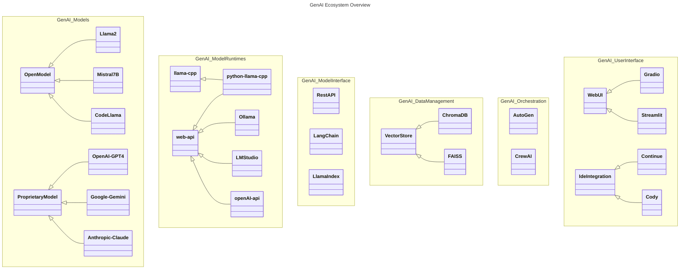
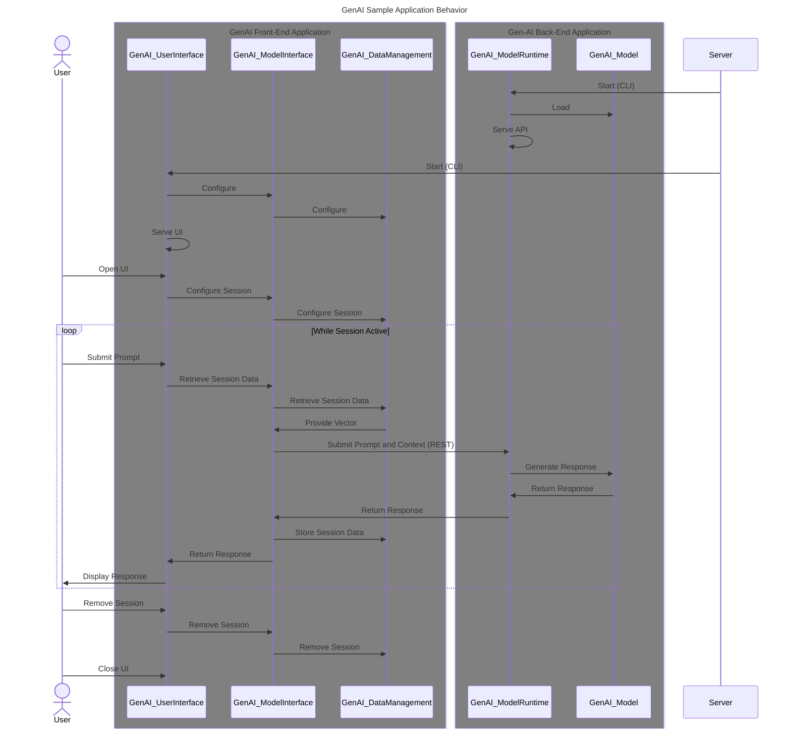

# Generative AI (GenAI) Ecosystem

This document attempts to describe the ecosystem of tools and techniques that are used to create Generative AI (GenAI) applications.  It is a work in progress and will be updated as I learn more.  This is primarily based on months of observation and the hands-on experimentation contained within this repository.

Although there is substantial discussion within the media around the broad applicability of AI technologies, we are focusing on the generation of text based on prompts and supporting material.  Use cases are important in this context as they estabilish the context for the application of the technology.  We'll start with a few ultra-high level use cases and then explore the ecosystem of tools and techniques that are used to create them.

## Writing Assistant

The principle use case for GenAI technologies surrounds the creation of written works.  This may be the creation of of tailored content based on a topic of interest as provided via a prompt.  This may be the summarization of a larger body of text.  This may also be more conversational in nature, such as a chatbot.  Ideally the underlying model is sufficiently knowledgable to provide a coherent response to a wide range of questions.  It is possible to enhance the model's knowledge by providing it with a corpus of information that it can use to answer questions.  The principle means of interaction is one-on-one, human-to-machine.  Alternative strategies are maturing where the human interacts with a team of AI agents who collaborate to provide an improved response, or even employ tools in the creating of the response.

## Coding Assistant

The secondary use case for GenAI technologies surrounds the creation of software.  Software has the desirable characteristic of being text based, aligning to the foundational capabilities fo the GenAI technology.  But while highly structured in nature (and therefore demonstrabable wrong when incorrect), it is also highly creative in nature.  This is a challenging domain for GenAI technologies.  The principle means of interaction is one-on-one, human-to-machine, but this is amplified by integrating the GenAI into the development environment.  This allows the GenAI to provide suggestions and corrections as the developer is working.  This is a very powerful capability that can be used to improve the quality of the code being written, tested, or documented.  Although some in the media have forcasted the end of the software developer, the more likely outcome is that the GenAI will be used to augment the developer's capabilities and enhance productivity.  The underlying myth is that a developer just sits and hacks out code based on someone else's good ideas.  The reality is that a developer spends a lot of time researching, reading, and thinking about the problem at hand.  The GenAI can be used to accelerate this process by providing suggestions and corrections as the developer is working.  This is a very powerful capability that can be used to improve the quality of the code being created.  The GenAI will take on certain development tasks that are tedious and error prone, freeing the developer to focus on the more creative aspects of the problem at hand.

# GenAI Ecosystem Core Elements

The GenAI ecosystem is comprised of a number of core elements that are used to create GenAI applications.  These elements are: the model, the model runtime, the model interface, data management, orchestration, and user interface.  The following diagram depicts a sampling of the technologies in each of these areas.



In general, depending on the use case, a GenAI application developer will select and configure elements from these areas to create their application.  The following sections will provide a brief overview of each of these areas.  But first let's examine a high level view of the behaviors and interactions involved in a generic GenAI application.  We'll explore the a simple web-ui chat bot.



Let's now examine each of the core elements in more detail.

## GenAI Models
The model is the core of the GenAI application.  It is the model that is trained to perform a specific task.  Training is a topic unto itself that we won't cover here.  There are two fundamental types of models, open and proprietary.  Proprietary models, such as OpenAI's GPT-4, are the best performing models in the world and are only available via subscriptions services.  Open models, such as Llama2 and Mistral7B, are available to anyone and can be used for free.  The tradeoff is that the open models are not yet as powerful as the proprietary models but are advancing rapidly.  A good source for reviewing open model performance is the [HuggingFace Open Model Leaderboard](https://huggingface.co/spaces/HuggingFaceH4/open_llm_leaderboard).

At their core, GenAI models are weights and balances for large neural networks (often loaded into Tensors for execution).  For our immediate purposes it isn't necessary to understand the internal details of the model.  It is important to understand the size of the model and the file format that it is stored in as these will impact the runtime that is used to execute the model.

Since our interest is in achieving a completely private and secure GenAI application, we will focus on open models as they do not require data to be transmitted outside a closed network environment like the proprietary models.  There's an enormous and growing community developing, fine-tuning, merging, and sharing open models on HuggingFace.  It is valuable to monitor th evolution of these models.

Before we dig into specific models, it's important to establish some terminology.

- **Parameter Size**: The number of trainable parameters in a model. This is a measure of the complexity of the model, with larger models generally able to learn more complex tasks.  Larger models are much larger in size and require substantial computeing resourses to run.
 
- **Quantization**: A process that reduces the number of bits that represent a number. In the context of machine learning models, quantization can reduce the memory requirements and computational cost of using the models.

- **Fine Tuned**: A model that has been further trained on a specific task after pretraining on a large corpus of data. Fine-tuning adjusts the weights of a pretrained model to make it more suitable for the specific task.
 
- **Instruction Tuned**: A model that has been fine-tuned to follow instructions embedded in the input. This is a specific type of fine-tuning used in language models to make them more controllable.
 
- **LLM File Format**: LLMs can be released in various file formats.  You must provide a model runtime capable of loading and running the particular file format you are using.  For more information see the [medium article](https://medium.com/@phillipgimmi/what-is-gguf-and-ggml-e364834d241c) describing common LLM file formats. The most common formats are:
  - **GGML (GPT-Generated Model Language)**: Developed by Georgi Gerganov, GGML is a tensor library designed for machine learning, facilitating large models and high performance on various hardware, including Apple Silicon.
  - **GGUF (GPT-Generated Unified Format)**: Introduced as a successor to GGML (GPT-Generated Model Language), was released on the 21st of August, 2023. This format represents a significant step forward in the field of language model file formats, facilitating enhanced storage and processing of large language models like GPT.  Developed by contributors from the AI community, including Georgi Gerganov, the creator of GGML, GGUF’s creation aligns with the needs of large-scale AI models, though it appears to be an independent effort. Its use in contexts involving Facebook’s (Meta’s) LLaMA (Large Language Model Meta AI) models underscores its importance in the AI landscape. For more details on GGUF, you can refer to the GitHub issue here and explore the llama.cpp project by Georgi Gerganov here.

We will focus on GGUF models as they are generally more available and easier to run with open tools.  Below is a listing of common high performance models worth exploration.

- **[Mistral 7B](https://huggingface.co/docs/transformers/main/en/model_doc/mistral)**:  Mistral 7B is a 7 billion parameter model trained on the Common Crawl dataset.  It is available in GGUF format and can be run using the llama-cpp model runtime.  It is available for download from the [HuggingFace model repository](https://huggingface.co/mistral-7b-instruct-v0.2.Q5_K_S.gguf).  It is generally recognized as one of the highest performing small foundational LLMs in existance at the time of writing.  The Mistral 7B model is released under an Apache 2.0 license.

- **[Llama 2](https://huggingface.co/docs/transformers/main/model_doc/llama2)**: Llama2 was developed by Meta (aka Facebook) and published under a permissible (but [not technically open source](https://opensourceconnections.com/blog/2023/07/19/is-llama-2-open-source-no-and-perhaps-we-need-a-new-definition-of-open/)) license. It available in various parameter sizes including 7, 13, and 70 billion parameters. Llama 2 is the second major release of the Llama LLM, and Mark Zuckerburg recently announced that Meta is currently in the process of training Llama3.  When released Llama 2 provided revolutionary performance in the open LLM community.  Llama 2 if requently used as the base model for many fine-tuned models.  It is available in GGUF format and can be run using the llama-cpp model runtime.  It is available for download from the [HuggingFace model repository](https://huggingface.co/llama-2-instruct-v0.2.Q5_K_S.gguf).

- **[Mixtral 8x7B](https://huggingface.co/docs/transformers/model_doc/mixtral)**: Mixtral 8x7B is an enhancement of the Mistral 7B model through the application of a Mixture of Experts layer.  A mixture of experts selects 2 pre-trained models during execution based on the prompt to produce a high quality response while maintaing a relative small resource demand.  When release, Mixtral 8x7B was the highest performing open LLM available.  It is available in GGUF format and can be run using the llama-cpp model runtime.  It is available for download from the [HuggingFace model repository](https://huggingface.co/mixtral-8x7b-instruct-v0.2.Q5_K_S.gguf).  Mixtral 8x7B is released under an Apache 2.0 license.

- **[Code-Llama](https://huggingface.co/codellama)**: Code-Llama is available as 7, 13, and 34 billion parameter models trained on a large corpus of code.  It is available in GGUF format and can be run using the llama-cpp model runtime.  It is available for download from the [HuggingFace model repository](https://huggingface.co/code-llama-instruct-v0.2.Q5_K_S.gguf).  Code-Llama is a derivation of Llama 2 fine-tuned for software development.

- **[Neural-Chat](https://huggingface.co/Intel/neural-chat-7b-v3)**: Neural-Chat is a 7 billion published by Intel.  It is available in GGUF format and can be run using the llama-cpp model runtime.  It is available for download from the [HuggingFace model repository](https://huggingface.co/neural-chat-instruct-v0.2.Q5_K_S.gguf).  Neural-Chat is a derivation of Mistral 7B and released under the Apache 2.0 license.

While there are many, many more potential models to consider these provide a good foundation for learning and research.  Often the foundational models are provided only in their "full performance" and "moderated" configuration.  It is very common for others in the community to perform additional fine-tuning or quantization on these models to make them usable for a wider range of applications.  Of particular note are 2 individuals who have published a substantial number of model derivations.

> **The Bloke (aka Tom Jobbins)**: The Bloke has published a number of fine-tuned models on HuggingFace.  These models are generally available at various quantization levels in GGUF format and can be run using the llama-cpp model runtime.  They are available for download from the [HuggingFace model repository](https://huggingface.co/TheBloke).
> 
> **Eric Hartford**: Eric Hartford has published a number of fine-tuned models on HuggingFace.  Eric is best known for the Dolphin fine-tuning which "removes" censorship from base LLMs.  These models are generally available at various quantization levels in GGUF format and can be run using the llama-cpp model runtime.  They are available for download from the [HuggingFace model repository](https://huggingface.co/cognitivecomputations).

## GenAI Model Runtimes
The model runtime is the software that is used to run the model.  

- **[Llama.cpp](https://github.com/ggerganov/llama.cpp)**: At the heart of many open model runtimes is the llama.cpp project.  This is a port of Facebook's LLaMA model in C/C++ for high performance.  It is available under the MIT license.  The llama.cpp project is used to create a number of model runtimes that are used to run the model.  The following is a list of the most common runtimes.  Check the readme file in the llama.cpp project for a list of binding available in many languages.

- **[Python-llama-cpp](https://github.com/abetlen/llama-cpp-python)**: Python-llama-cpp is the python binding of the llama.cpp project.  It allows you to load an run a model from within your python application.  It is available under the MIT license. It also provides a convenient web server called ```llama-cpp-python[server]``` that can be installed with ```pip``` and run from the command line.  This server provides the OpenAI API for using the model.  It is a very convenient way to run a model from within a python application, particularly if you're using libraries that default to usign the ```openapi``` libraries under the covers.

- **[Ollama](https://ollama.ai/)**: Ollama is an open source model runtime built to help people get up and running with LLMs quickly.  It is available under the MIT license.  It is a very convenient way to run a model from the command line.  My initial testing was done with Ollama and I had a model up and running on my laptop in 10 minutes and 34 seconds.  It does provide a very convenient way to retrieve and run [various supported models](https://ollama.ai/library).  But it does not provide the OpenAI API for using the model.  Some model interface libraries support the Ollama API directly, which is convenient.  But you can always use the REST API to interact with a model run within Ollama.  One particular benefit of Ollama is the ability to rapidly switch between models on a call-by-call basis.  It also allows you to define custom models using a [```Modelfile``` specification](https://github.com/jmorganca/ollama/blob/main/docs/modelfile.md).

- **[LM Studio](https://lmstudio.ai/)**: LM Studio is a proprietary model runtime that supports Windows, Linux, and Mac.  It provides a rather useful UI that allows the user to search for and download supported models on HuggingFace.  It also provides a chat interface so you can do everything with your LLM in a single UI.  LM Studio also allows you to run a server providing the openai apis for use by local applications.  While this may be a convenient way to get started with LLMs, it is not a good choice for a production environment as it is not open source (but is it free...so freeware).  The lack of openness of their code raises security concerns for me because I can't fork and scan it.

## GenAI Model Interface
The model interface is the software library that is used to interact with the model runtime from your application.  It is most common to see support for python and javascript/typescript.  In principle, these model interfaces handle the complexity of interacting with the model runtime and provide a simple API for your application to use.  As an application developer you may just want to provide a simple chat capability, which you can do directly with the model runtime's REST API.  But if you want to do something more complex, like parse and load documents into your query context, summarize some content, or integrate a vector store into you application, the model interface is very valuable.  Base on my research, there are 2 leading model interfaces that lead the community today.

- **[LangChain](https://www.langchain.com/)**: LangChain is a framework designed to simplify the creation of applications using large language models. As a language model integration framework, LangChain's use-cases largely overlap with those of language models in general, including document analysis and summarization, chatbots, and code analysis. LangChain recently released it's 0.1.0 version which restructured things into core and community capabilties.  While it was done in a way that maintained backward compatibility, be prepared for deprication errors if you're pulling from online examples and using the latest release in your application.  LangChain is open source and available under the MIT license.  See the [LangChain GitHub repository](https://github.com/langchain-ai/langchain) for more information.  In my experience, LangChain can be a bit of a learning curve, but works well once you have your head around it.

- **[LlamaIndex](https://www.llamaindex.ai/)**: LlamaIndex is a data framework for LLM-based applications to ingest, structure, and access private or domain-specific data. It’s available in Python (these docs) and Typescript.  LlamaIndex provides data ingestion, data indexing, and query interface to support application development.  LlamaIndex is open source and available under the MIT license.  See the [LlamaIndex GitHub repository](https://github.com/run-llama/llama_index) for more information.  In my experience, LlamaIndex seems like it's APIs are simpler than LangChain, but getting it to work was challenging.  It doesn't seem as mature as LangChain based on my limited interaction with both.

## GenAI Data Management
Data management is the software that is used to manage data in your application.  The while the model is an amazingly vast store of knowledge, it is not a database.  It is not designed to store and retrieve data.  It is designed to generate text based on a prompt and context.  But it is possible to use the model to generate a vector for a given prompt and context.  This vector can be used to search a vector store for similar vectors.  This is a very powerful capability that can be used to enhance the capabilities of your application.  Unfortunately, this is an area I do not yet have much knowledge so I'll simply provide information and links for future research.  While there are some priprietary SaaS vector stores available, we'll focus on the open solutions that can self-hosted.  The following are some of the more common vector stores that are used in GenAI applications.

- **[ChromaDB](https://www.trychroma.com/)**: ChromaDB is a vector store that is designed to store and retrieve vectors.  It is open source and available under the Apache 2.0 license.  See the [ChromaDB GitHub repository](https://github.com/chroma-core/chroma) for more information.
- **[FAISS](https://faiss.ai/)**: FAISS is a library for efficient similarity search and clustering of dense vectors.  It is open source and available under the MIT license.  See the [FAISS GitHub repository](https://github.com/facebookresearch/faiss) for more information. 

### GenAI Orchestration
Orchestration is the software that is used to define manage the execution of agents in a GenAI application.  The concept of agents is relatively new in the GenAI community.  It is a powerful concept that allows you to define a set of agents that can be used to perform collaborate by performing specific tasks.  The agents can be used to perform a task individually or in concert with other agents.  The orchestration software is used to define the agents and their interactions.  The orchestration software is also used to manage the execution of the agents. Of particular significance is the ability to define and assign tools to specific agents.  These tools can perform tasks like searching the web or even running code. The following are some of the popular orchestration tools that are used in GenAI applications.

- **[AutoGen](https://microsoft.github.io/autogen/)**: AutoGen is a framework that enables the development of LLM applications using multiple agents that can converse with each other to solve tasks. AutoGen agents are customizable, conversable, and seamlessly allow human participation. They can operate in various modes that employ combinations of LLMs, human inputs, and tools. It is open source and available under the Creative Commons and MIT license.  See the [AutoGen GitHub repository](https://github.com/microsoft/autogen) for more information.
- **[CrewAI](https://www.crewai.io/)**: CrewAI is a cutting-edge framework for orchestrating role-playing, autonomous AI agents. By fostering collaborative intelligence, CrewAI empowers agents to work together seamlessly, tackling complex tasks. It is open source and available under the MIT license.  See the [CrewAI GitHub repository](https://github.com/joaomdmoura/crewAI) for more information.

### GenAI User Interface
The user interface is the software that is used to interact with the GenAI application.  In reality, there is nothing preventing anyone from creating their own UIs with whatever UI software or frameworks they're comfortable with.  But there are a number of UI frameworks that are commonly used in the GenAI community.  The GenAI focused frameworks provide handy components for common AI related tasks such as providing multi-modal content (i.e. documents, images, audio, video) within the UI.  They also provide common components that support behaviors like chat and chat streaming, without the developer needing to get into the nuiance of low level API handling.  The following are some of the more common UI frameworks that are used in GenAI applications.

- **[Gradio](https://www.gradio.app/)**: Gradio is an open-source Python package that allows you to quickly build a demo or web application for your machine learning model, API, or any arbitary Python function. You can then share a link to your demo or web application in just a few seconds using Gradio's built-in sharing features. No JavaScript, CSS, or web hosting experience needed!  Gradio is used to power the HuggingFace web UI. It is open source and available under the Apache 2.0 license.  See the [Gradio GitHub repository](https://github.com/gradio-app/gradio) for more information.
- **[Streamlit](https://streamlit.io/)**: Streamlit is an open-source Python library that makes it easy to build beautiful custom web-apps for machine learning and data science.  It is open source and available under the Apache 2.0 license.  Streamlit lets you turn data scripts into shareable web apps in minutes, not weeks. It’s all Python, open-source, and free! See the [Streamlit GitHub repository](https://github.com/streamlit/streamlit) for more information.
- **[Continue](https://marketplace.visualstudio.com/items?itemName=Continue.continue)**: Continue is the open-source autopilot for software development—an IDE extension that brings the power of ChatGPT to VS Code and JetBrains.  Continue is open source and available under the Apache 2.0 license.  See the [Continue GitHub repository](https://github.com/continuedev/continue) for more information.
- **[coLLaMA](https://github.com/iohub/coLLaMA)**: VSCode AI coding assistant powered by self-hosted llama.cpp endpoint.  coLLaMA is short for Cody Llama. Cody is a free, open-source AI coding assistant that can write and fix code, provide AI-generated autocomplete, and answer your coding questions.  It is open source and available under the Apache 2.0 license.  See the [coLLaMA GitHub repository](https://github.com/iohub/coLLaMA) for more information.