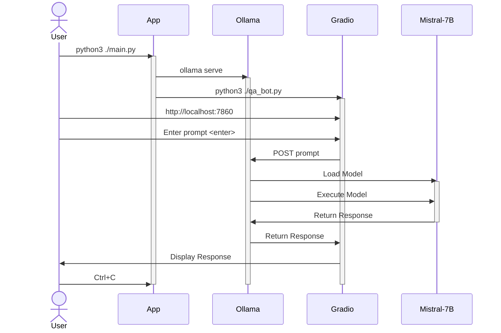

# Basic Mitch Q&A AI Bot

The simplest miminum viable product for a chatbot is a bot that can answer questions. It is not very smart, in that it maintains no conversational memory and has not ability to use data outside the LLM or user prompt, but it can answer questions.  It provides a minimal web ui for simplified user interaction with asking questions and getting answers.

The name "[Basic Mitch](https://www.youtube.com/shorts/q9cP9L0IcgM)" is taken from the [Andy Cooks](https://www.youtube.com/@andy_cooks/featured) youtube channel.

## Technology

This MVP is based on the following technology:
- Ollama:  A LLM execution tool for linux.
- Mistral 7B:  A LLM model trained on the Mistral 7B dataset and run through Ollama.
- Gradio: A python-based web ui framework tailored for AI applications.  Gradio communicates with Ollama via a REST API.

Let's look at each item in detail.

### Ollama
Ollama is a open source software tool that allows you to run LLMs on linux.  It is a command line tool that can be used to run LLMs from the command line or via a REST API.  Ollama provides commands to easily allow you to download and execute models from the Hugging Face model repository.  Under the covers Ollama is a golang applicaiotn that uses llama.cpp to execute the LLMs.  Ollama is available from the [Ollama Github Repository]() and is installed via the following command:
    ```bash
    curl https://ollama.ai/install.sh | sh
    ```

### Mistral 7B
Mistral 7B is a LLM model trained on the Mistral 7B dataset.  It is available from the [Hugging Face Model Repository](https://huggingface.co/).  The model is downloaded and installed using the following command:
    ```bash
    ollama pull mistral
    ```
This command will download the model and install it in the ```~/.ollama/models``` directory.  The model is then ready to be used by Ollama.  Practically speaking the Mistral 7B model is a GGUF file.  GGUF, previously GGML, is a quantization method that allows users to use the CPU to run an LLM but also offload some of its layers to the GPU for a speed up. Although using the CPU is generally slower than using a GPU for inference, it is an incredible format for those running models on CPU or Apple devices.  Ollama pulls the encoded data from the Mistral 7B GGUF file to establish the tensors and weights for the model.  The model is then ready to be used by Ollama.

In this specific instance, based on past observation, we established a custom model using a ```Modelfile``` to set the temperature parameter and system prompt for model execution.
```
FROM mistral
PARAMETER temperature 0.2
SYSTEM """
You are an advanced AI assistant using the Mistral 7B model. You are capable of understanding and generating responses for a wide range of topics. Your goal is to provide accurate, helpful, and contextually appropriate responses to user queries. You maintain a neutral and professional tone in your interactions.
"""
```
This simplifies the REST API call to Ollama in that we don't have to provide these in the ```POST``` request.  We can simply provide the model name and prompt to get a response.  Alternatively, if we wanted to increase user flexibility, we could have allowed the user to set these (as well as other) prompts which could be passed into each individual REST API call resulting in a more flexible bot.

This indicates that although certain parameters can be maintained in a custom model definition, neither Mistral 7B or Ollama maintain a "hard" internal state.  If we desire strict control on these parameters, we'll need to establish facades to maintain them.  We'll probably need to look at this in the future.

### Gradio
[Gradio](https://www.gradio.app/docs/chatbot) is a python-based web ui framework tailored for AI applications.  It provides a simple way to create a web ui for an AI application.  In this instance we just use it to provide a chatbot window and a user prompt text box.  Gradio communicates with Ollama via a REST API.  The Gradio app is a simple python script that launches the web ui and provides a REST API endpoint for the web ui to communicate with Ollama.  The Gradio app is launched using the following command:

```bash
python3 ./qa_bot.py
```

Gradio provides a degree of simplicity which is nice, but is (IMHO) a little confusing to work with.  The APIs aren't completely clear.  Simple things like clearing the user prompt text box after a response is returned is not obvious.  The documentation is a little sparse and the examples are a little too simple.  It's a useful tool, but it may require some learning / practice before it truely feels easy to use.

## How it all works together
These tools provide one of the simplest ways to get started with LLMs using a web ui.  The following diagram shows how the pieces fit together.  In this instance we've automated everything using apython App called ```main.py``` that launches the Ollama server and the Gradio web ui.  The user can then interact with the web ui to ask questions and get answers.  The web ui also logs prompts, responses, and durations to a simple markdown file called ```assistant_log.md```.  The Ollama server can be used to run any LLM model, but in this case we're using the Mistral 7B model.  The ```main.py``` app also provides resource monitoring of CPU, Memory, GPU, and GPU memory during execution in a simple CSV file called ```usage.csv```.

Neither Ollama or Mistral 7B have been modified in any way.  The only modification is the addition of the ```main.py``` app and the ```qa_bot.py``` app that is used by Gradio to provide the web ui.  Even the Gradio app is about as simple as possible, only collecting a user prompt, submitting it to Ollama via a REST API, and displaying the response.  There is no "memory" maintained within Ollama the Mistral 7B model.  In a separate use case we'll look at how to add memory to a model by adding a chat history to the Gradio configuration.



## Approach

We can basically take the work from last week and just reuse it, but I'd like to enhance the data collection a bit.
- Take what we learned from custom models and apply it to the Mistral 7B model for a general purpose bot.
- Reuse the /ollama/webui code from last week.
- Add the system monitoring from /ollama/auto_run.
- Add a top level script to launch and run everything from a single command.
- Add GPU monitoring to the system monitoring.
- Add logging to capture prompts, responses, and response times that outputs in markdown for easier reuse in document creation and sharing.

## Implementation

1. Create the custom model using ```ollama create mistral_assistant -f ./Modelfile```
1. Begin monitoring system utilization
1. If not already running, launch ```ollama serve``` process
1. Launch gradio web ui (remove any usage of chat_hostory)

## Usage

1. Open web ui in a browser:  http://127.0.0.1:7860/ (Note: The port may increment)
1. Manually provide some prompts and see what's returned.
1. Request a few options for some topic
1. Request more detail on a returned option without naming it (i.e. option 2, or the last option)

## End

1. Close the browser
1. Terminate the CLI command (ctrl+c)
1. Review log to ensure data was captured

## Observations

Running on my windows laptop in a WSL (Ubuntu 20.04) environment, the system usage monitoring in Task Manager doesn't align with what's reported in the usage.csv file.  I'm not sure why this is, but it's something to be aware of.  I'm not sure if it's a WSL issue or a Task Manager issue.  I'm hoping this won't be the case in a "real" dev environment.  I'll need to investigate further when we transition to a more permanent situation.

In general when the model is working on a prompt, the CPU utilization is between 80-95% (mostly hovering at 85%), memory is stable around 75% (23.5GB used), the GPU spikes to 100% initially then settles at 50%, and GPU memory is at 100% (6GB VRAM) constantly.  If I terminate the Gradio process without also stopping Ollama (maybe it's just a timeout thing) when I rerun the model transitions to a CPU-only state with no GPU usage.

On thing I really like is how the Gradio ChatBot UI component properly formats and displays markdown output.  This is why I decided to try and capture the AI prompt and responses in a markdown format within the log.  This makes it easy to copy and paste into a document for sharing than the JSON format I used before.