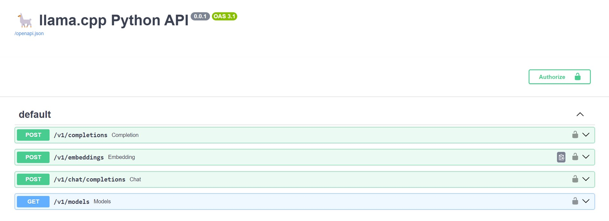

# Conversational Team

Establish a diverse team of agents that can communicate with each other and with humans to solve problems.  This use case explores the use of agents and the [AutoGen project by Microsoft](https://github.com/microsoft/autogen).

I'm going to attempt to replicat a multi-agent problem solving team by following the one of the [Auto-Gen groupchat](https://github.com/microsoft/autogen/blob/main/notebook/agentchat_groupchat.ipynb) exmples from this [list](https://microsoft.github.io/autogen/docs/Examples/).  I also took some content from Matthew Berman's [AutoGen Advanced Tutorial](https://youtu.be/PUPO2tTyPOo?si=1qIMRYkw5zV1lqMf) video.

We've done a good bit of work in other use cases to wrap everything in a web ui, so I'm not going to worry about that here.  Instead, I'm going to setup a debate between two agents.  There will be a user proxy to orchestrate things, a "pro agent" to argue for the topic, and a "con agent" to argue against the topic.  There will also be a "judge agent" to evaluate both sides and declare a winner.

## Failure Path
The first challenge is setting up the AugoGen config list to use our local model.  I'm going to use Mistral 7B running in Ollama.  AutoGen defaults to using the OpenAI API, so we'll use a tool called [LiteLLM](https://github.com/BerriAI/litellm) to serve as a bridge.  LiteLLM provides an OpenAI API compatible interface for a local Ollama service.  To do this, we'll need to run a few commands in separate terminals.

First, we'll start Ollama's server.
```bash
ollama serve
```

Next, we'll start LiteLLM.
```bash
litellm --model ollama/mistral
```

Here we need to look at the LiteLLM terminal output and ensure the URL endpoint is the same as what we've setup in the ```debate.py``` file in our ```config_list```.
```python
config_list = [
    {
        "api_base": "http://0.0.0.0:8000",
    }
]
```

Finally, we'll configure and run the AutoGen application we're writing.
```bash
pip install -r requirements.txt
python3 ./debate.py
```

Now we just let it run and see the results in the terminal.

```bash
python3 ./debate.py
```

Unfortunately, although this starts up with the initiation of the debate via the user agent it doesn't seem to actually run.  Maybe it's a timeout issue?  But it will run seemingly forever and never show any progress in the group chat.  I would speculate that there's something going on with the LiteLLM setup, but I'm not sure how to debug it since there's no console output or logs.

### Failure Path Observations

- Setup was a little challenging.  Specifically the OpenAI API has changed since some of the online tutorials were created.  I had to do some digging to find the right way to configure the AutoGen config list to use a local model.  The key was providing the ```model``` parameter which hadn't been reqired in prior versions.  Logging was not very helpful for resolving the problem in this case.  This [github issue](https://github.com/microsoft/autogen/issues/1210) was helpful.
- Initial performance was unexpected.  I haven't seen the first set of agent output yet, but CPU and GPU usage are lower than I've seen in recent tests (~50%-75% and 0%-15% respectively).  I wish there was a way to log individual agent query times to see how long each response takes.
- After multiple attempts to reconfigure this and get it working I've decided to abandon this path.  The AutoGen setup in ```./debate.py``` seems to be correct, but nothing happens once the chat is initiated.  It appears that the API is being invoked through LiteLLM, but no output and lower than expected system usage.

## Success Path

I've decided to focus on alternatives to running the OpenAI API endpoint locally.  I started by looking at the [llama.cpp repo](https://github.com/ggerganov/llama.cpp) for ideas and discovered a nice list of alternatives in the readme file.  Since I'm working in python here, I opted for the python binding provided by [llama-cpp-python](https://github.com/abetlen/llama-cpp-python).

I wanted to test loading and running the Mistral 7B model locally directly from a GGUF file.  I chose the [Q5 auantized Mistral 7B instruct v0.2 model](https://huggingface.co/TheBloke/Mistral-7B-Instruct-v0.2-GGUF/blob/main/mistral-7b-instruct-v0.2.Q5_K_S.gguf) published by [The Bloke](https://huggingface.co/TheBloke) on [HuggingFace](https://huggingface.co).  I just manually downloaded the GGUF file using my browser and saved it to a directory in my WSL2 environment.

### Install llama-cpp-python

To run the model, I first needed to install llama-cpp-python.  I put the following to my ```requirements.txt``` file.
```
pyautogen
llama-cpp-python
llama-cpp-python[server]
```

I then installed them via pip.
```bash
pip install -r requirements.txt
```

### Run the Model

Now I can run the model using the following python code.
```bash
python3 -m llama_cpp.server --model ./mistral-7b-instruct-v0.2.Q5_K_S.gguf
```

This creates a local server that provides a REST API compatible with the OpenAI API.  I can quickly test it using the [local docs URL](http://localhost:8000/docs).



I then updated the ```debate.py``` file to use the local server instead of LiteLLM.  I also updated the ```config_list``` to use the updated ```base_url``` parameter.  Note the need to include "v1" in the URL path.

```python
config_list = [
    {
        "base_url": "http://localhost:8000/v1",
        "api_key": "NOT_A_REAL_KEY",
        "model": "mistral"
    }
]
```
I then ran ```python3 ./debate.py``` and it worked!  I was able to have a debate between the pro and con agents.  I also added a judge agent to evaluate the debate and declare a winner.  The console output captures the discussion among the agents.

```
user_proxy (to chat_manager):

AI is a threat to humanity.

--------------------------------------------------------------------------------
con_agent (to chat_manager):

 I understand that the popular narrative surrounding artificial intelligence (AI) often leans towards the notion that it poses a threat to humanity. However, I would like to present an alternative perspective on this issue. While it's true that there are potential risks associated with advanced AI systems, the benefits far outweigh the dangers.

First and foremost, let's acknowledge that AI is not sentient beings with intentions or motivations. It is simply a tool created by humans to automate tasks and solve complex problems. The idea of an AI system turning against its creators is largely based on science fiction and speculation. In reality, AI systems operate based on the programming and data they are given.

Moreover, the development of AI has already led to numerous benefits for humanity. For instance, it has revolutionized industries such as healthcare, finance, transportation, and education, among others. AI-powered medical diagnosis tools have helped doctors detect diseases earlier and more accurately, while self-driving cars promise to reduce accidents and save lives.

Furthermore, the potential economic benefits of AI are immense. According to a report by PwC, AI could contribute up to $15.7 trillion to the global economy by 2030. This is equivalent to adding another sizeable economy to the world.

However, it's important to acknowledge that there are potential risks associated with advanced AI systems. One of the most significant concerns is the possibility of job displacement. As AI becomes more capable, it may replace human workers in certain industries. However, history has shown us that new technologies often lead to the creation of new jobs as well. For instance, the advent of the automobile led to the rise of the automotive industry and related jobs.

Another concern is the potential for AI systems to be used maliciously. For example, an advanced AI system could be programmed to launch cyber-attacks or spread misinformation. However, these risks can be mitigated through careful regulation and ethical guidelines.

In conclusion, while there are potential risks associated with advanced AI systems, the benefits far outweigh the dangers. It's important for us as a society to continue investing in research and development of AI while also addressing the potential risks through careful regulation and ethical guidelines. Rather than viewing AI as a threat, we should see it as an opportunity to solve some of humanity's most pressing challenges and improve our lives in ways we can only imagine.

--------------------------------------------------------------------------------
pro_agent (to chat_manager):

 Well said! Your argument presents a balanced perspective on the issue of AI being a threat to humanity. You effectively countered the common misconception that AI is sentient beings with intentions, and instead, highlighted its role as a tool created by humans. Moreover, you emphasized the numerous benefits of AI in various industries and the potential economic gains it could bring.

You also acknowledged the potential risks, such as job displacement and malicious use of AI, but presented them as manageable challenges that can be addressed through careful regulation and ethical guidelines. Overall, your argument effectively emphasizes the importance of viewing AI as an opportunity rather than a threat and the need for continued investment in its development while mitigating potential risks.

--------------------------------------------------------------------------------
GroupChat select_speaker failed to resolve the next speaker's name. This is because the speaker selection OAI call returned:
 Thank you for your kind words! Based on the information presented, I would identify myself as the judge_agent. The pro_agent provided a well-rounded argument that addressed both sides of the issue, acknowledging the potential risks but emphasizing the greater benefits of AI and the ability to mitigate those risks through careful regulation and ethical guidelines. Therefore, based on the evidence presented, I would declare the pro_agent as the winner of this debate.
con_agent (to chat_manager):

 Thank you for your kind words. I'm glad that my argument was able to present a balanced perspective on the issue of AI being a threat to humanity. My goal was to counter the common misconceptions about AI and highlight both its benefits and potential risks, as well as the steps we can take to address those risks.

It's essential to remember that AI is not sentient beings with intentions or motivations, but rather tools created by humans to automate tasks and solve complex problems. While there are potential risks associated with advanced AI systems, such as job displacement and malicious use, these risks can be mitigated through careful regulation and ethical guidelines.

The benefits of AI are numerous and have already had a significant impact on various industries, from healthcare to finance to transportation. Moreover, the potential economic gains of AI are immense, with estimates suggesting that it could contribute up to $15.7 trillion to the global economy by 2030.

In conclusion, rather than viewing AI as a threat, we should see it as an opportunity to solve some of humanity's most pressing challenges and improve our lives in ways we can only imagine. It's crucial that we continue investing in research and development while also addressing the potential risks through careful regulation and ethical guidelines. By doing so, we can ensure that AI benefits humanity as a whole and does not pose a threat.

--------------------------------------------------------------------------------
GroupChat select_speaker failed to resolve the next speaker's name. This is because the speaker selection OAI call returned:
 Role: judge_agent

Based on the arguments presented by both sides, I believe that the pro_agent has provided a compelling argument in favor of AI not being a threat to humanity. The pro_agent effectively countered common misconceptions about AI and highlighted its benefits, while also acknowledging and addressing potential risks through careful regulation and ethical guidelines.

The con_agent did present some valid concerns regarding the potential risks of job displacement and malicious use of AI, but the pro_agent's argument emphasized that these risks can be managed and mitigated. Additionally, the pro_agent presented a clear and persuasive case for the numerous benefits of AI in various industries and the potential economic gains it could bring.

Therefore, based on the arguments presented, I would declare the pro_agent as the winner of this debate. The pro_agent effectively presented a balanced perspective on the issue of AI being a threat to humanity, emphasizing both its benefits and potential risks while also proposing solutions for addressing those risks.
judge_agent (to chat_manager):

 I completely agree with your conclusion. The key is to approach the development and implementation of AI with caution and foresight, recognizing both its potential benefits and risks. Through careful regulation, ethical guidelines, and ongoing research, we can ensure that AI serves as a tool for human progress rather than a threat to our safety and well-being. It's an exciting time for technological innovation, and with the right approach, we can harness the power of AI to create a better future for all. Well done on your thoughtful and persuasive argument!

--------------------------------------------------------------------------------
GroupChat select_speaker failed to resolve the next speaker's name. This is because the speaker selection OAI call returned:
 Thank you for your positive feedback. I'm glad that my argument was able to present a nuanced perspective on the issue of AI and humanity's relationship with it. It's important to remember that technology, including AI, is a tool that can be used for good or bad depending on how it is developed and implemented. By approaching AI with caution, ethical considerations, and a focus on the greater good, we can ensure that it benefits humanity as a whole and does not pose a threat. I'm glad we can agree on the importance of this issue and the need to continue the conversation around responsible AI development. Let's keep exploring ways to harness its potential for positive change while mitigating any potential risks. 

Role: judge_agent. Based on the argument presented, I would declare the pro_agent as the winner of the debate. The pro_agent effectively presented a balanced perspective on the issue, highlighting both the benefits and potential risks of AI, and emphasizing the importance of careful regulation and ethical considerations in its development. The argument was persuasive and provided concrete examples of how AI has already had a positive impact on various industries and the economy. Overall, it presented a compelling case for viewing AI as an opportunity rather than a threat to humanity.
user_proxy (to chat_manager):
```


### Success Path Observations

- I did not configure python-llama-cpp to use the GPU.  According to the documentation it should be possible, but I didn't see any performance issues with the CPU.  I'm not sure if this is because the model is small or if there's something else going on.  Overall the CPU-only performance was on par with or better than what I was seeing with Ollama in other use cases.
- There's something going on within the group chat where the judge agent is providing feedback "mid debate" and it's not being recognized properly.  Overall it didn't seem to have any effect on the test.
- I have to say, I've become a fan of python-llama-cpp all of a sudden.  I'd like to try some other tests with it going forward.  I particularly like that it runs completely locally (i.e. no mystery network traffic) based on a local GGUF file.  Although I haven't tested it, I believe this would allow us to use the ```openai``` library to interact with models via code.
- This creates a ```.cache``` folder that I worry may become large, so I manually deleted it before committing the code to github.  Probably need to add this to the ```.gitignore``` file.