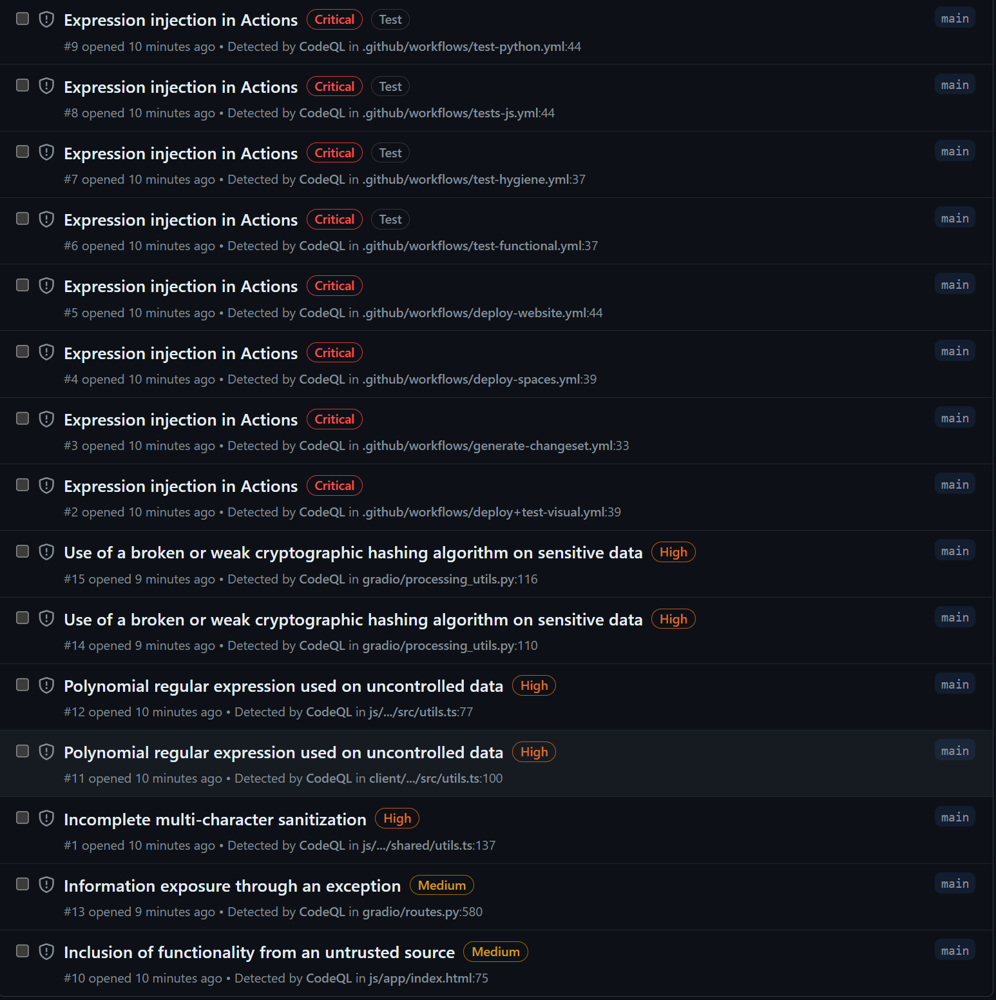
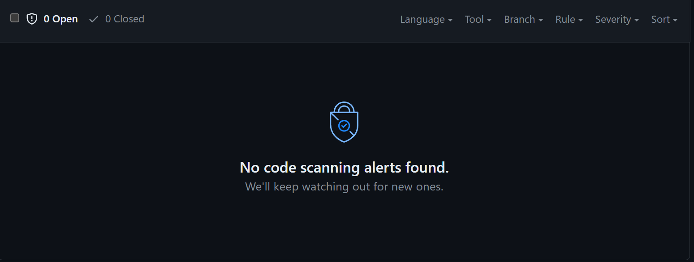
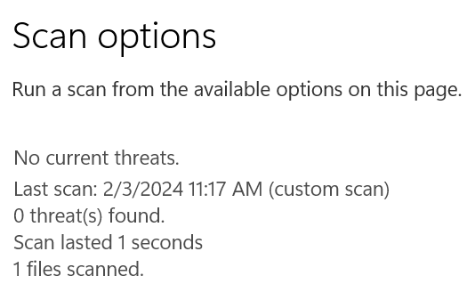

# AI Minimum Viable Product (MVP)

Based on the exploration performed in the ecosystem, I'm going to build a MVP that will be used to assert the feasibility of a stand-alone / private LLM chat capability.  

## Components

1. Mistral 7B (for now): The Mistral 7B model performed very well in my testing and was something I could run on my laptop.  I'll reserve the right to upgrade to a more powerful model if needed.
1. Llama.cpp (python):  This runtime gave me really good performance in comparison to Ollama along with an OpenAI compatible API.  I probably won't go for the GPU acceleration here, but may explore that in the future.
1. Gradio:  This provided a good UI out of the box and was easy to use.  I may explore other UI options in the future, but this is a good starting point.

There will be 2 processes at play here:  llama.cpp running the model and the Gradio UI.  I'll be using OpenAI API (i.e. REST API) for interaction between the two processes.

## Setup

First things first, let's create our conda virtual environment before we do anything.

```bash
conda create --name mvp
conda activate mvp
```

Now we just need to install the requirements.

```bash
pip install -r requirements.txt
```

## Running the Model

I did this as I had done for previous examples.  Simply download the GGUF file you want to run and then run the server.  In this instance, I'm bumping up the token size to 8192 because I encountered token threshold errors in testing.

```bash
python3 -m llama_cpp.server --model ./mistral-7b-instruct-v0.2.Q5_K_S.gguf --n_ctx 8192
```

## Running the UI

This is where things got difficult.  Llama_cpp_server supports the new OpenAI v1.0 API, but most of the examples on the web are for the older API.  I ended up finding [documentation on the OpenAI](https://platform.openai.com/docs/api-reference/streaming#chat/create-stream) website that worked for me.  I specifically wanted to try streaming to improve the user experience, and that was tough to figure out for the first time.  I didn't do anything fancy with Gradio, just used the built-in defaults.  Overall it works, but the model's stream response rambles on-and-on sometimes.  I'll have to figure out how to improve that in the future.

```bash
python3 ./qa_bot.py
```

## Observations
- I'm pleased gradio provides a simple user auth capability, I can't figure out how to get the user id from the gradio authentication.  Surely this is possible.
- I can't figure out how to setup a streaming resposne in gradio without using the ChatInterface.  This is probably okay for now, but it means we can't do custom layouts.
- Sometimes the model seems to get stuck in a loop.  It just keeps repeating content...usually afterthoughts.
- Streaming the response is a pretty dramatic improvement in user experience.  The ability to stop it when it gets into a loop is key.
- I encountered errors running out of tokens in the API when my history got too long.  At least the error message was clear.  This is why I bumped up the token count from the default 2K to 8K.  I had it do some pretty big stuff with the 8K setting and it didn't error out.

After a few prompts I got the following error in the qa_bot client:    
```bash
openai.BadRequestError: Error code: 400 - {'error': {'message': "This model's maximum context length is 2048 tokens. However, you requested 2078 tokens (2078 in the messages, None in the completion). Please reduce the length of the messages or completion.", 'type': 'invalid_request_error', 'param': 'messages', 'code': 'context_length_exceeded'}}
```

But it appears to have originated in the LLM server:
```bash
Exception: Requested tokens (2078) exceed context window of 2048
Traceback (most recent call last):
  File "/home/jdblack/.local/lib/python3.11/site-packages/llama_cpp/server/errors.py", line 170, in custom_route_handler
    response = await original_route_handler(request)
               ^^^^^^^^^^^^^^^^^^^^^^^^^^^^^^^^^^^^^
  File "/home/jdblack/.local/lib/python3.11/site-packages/fastapi/routing.py", line 274, in app
    raw_response = await run_endpoint_function(
                   ^^^^^^^^^^^^^^^^^^^^^^^^^^^^
  File "/home/jdblack/.local/lib/python3.11/site-packages/fastapi/routing.py", line 191, in run_endpoint_function
    return await dependant.call(**values)
           ^^^^^^^^^^^^^^^^^^^^^^^^^^^^^^
  File "/home/jdblack/.local/lib/python3.11/site-packages/llama_cpp/server/app.py", line 368, in create_chat_completion
    first_response = await run_in_threadpool(next, iterator_or_completion)
                     ^^^^^^^^^^^^^^^^^^^^^^^^^^^^^^^^^^^^^^^^^^^^^^^^^^^^^
  File "/home/jdblack/.local/lib/python3.11/site-packages/starlette/concurrency.py", line 41, in run_in_threadpool
    return await anyio.to_thread.run_sync(func, *args)
           ^^^^^^^^^^^^^^^^^^^^^^^^^^^^^^^^^^^^^^^^^^^
  File "/home/jdblack/.local/lib/python3.11/site-packages/anyio/to_thread.py", line 33, in run_sync
    return await get_asynclib().run_sync_in_worker_thread(
           ^^^^^^^^^^^^^^^^^^^^^^^^^^^^^^^^^^^^^^^^^^^^^^^
  File "/home/jdblack/.local/lib/python3.11/site-packages/anyio/_backends/_asyncio.py", line 877, in run_sync_in_worker_thread
    return await future
           ^^^^^^^^^^^^
  File "/home/jdblack/.local/lib/python3.11/site-packages/anyio/_backends/_asyncio.py", line 807, in run
    result = context.run(func, *args)
             ^^^^^^^^^^^^^^^^^^^^^^^^
  File "/home/jdblack/.local/lib/python3.11/site-packages/llama_cpp/llama_chat_format.py", line 295, in _convert_text_completion_chunks_to_chat
    for i, chunk in enumerate(chunks):
  File "/home/jdblack/.local/lib/python3.11/site-packages/llama_cpp/llama.py", line 793, in _create_completion
    raise ValueError(
ValueError: Requested tokens (2078) exceed context window of 2048
INFO:     127.0.0.1:34140 - "POST /v1/chat/completions HTTP/1.1" 400 Bad Request
```
- It took some sleuthing, but I finally figured out how to get the user id from the gradio authentication.  The secret sause is to grab the `gr.Request` object as the last parameter to an invoked function.  It's not in the documentation, but I found it in the a GitHub issue discussion.  The QA bot now logs the user id and the user's message.  This will be helpful for future analysis.  I wonder what else is in that `gr.Request`?
- Although I intended to setup a main app that would launch everything and collect usage, I don't know how to find a process by anything other than the process name.  Since llama-cpp-python is just running "python" I can't differentiate it from other python processes.  This probably isn't important right now as I can just watch the lines in task manager for my manual testing, but we need a way to monitor usage in the future.
- The Gradio documentation isn't all that great, particularly the API documentation.  While it has been very useful (especially the guides and examples), the API documentation seems to include content and parameters that just don't exist...and some things that do exist aren't documented.
- I really like the avatars in the chat window, but I'm not a huge fan of what I'm using at the moment.  I just generated a copule things using Midjourney...but we need to do better.
- I'm not using GPU acceleration, and I'm actually quite impressed with the performance.  Some of this is due to the switch to streaming (i.e. watching output appear incrementally feels much better than just waiting for one big output), but I think some is due to llama-cpp-python's performance.
- The system prompt I'm using certainly has a powerful impact on performance, but I'm not completely loving what's there.  Emphasis on being correct and concise seems to be extremely important.  The whole "OK" thing doesn't really help and sometimes confuses things.  It's probably worth the effort to research and test different system prompts.
- I'm pleasantly surprised by the responses provided by the model.  I'm not really doing anything challenging, but in general it does a good job of providing a response that is relevant to the prompt and correct.  It would be good to create a better test suite to evaluate this.
- If I close the browser tab and then re-open the URL in another tab, the user login persists but the chat history is gone.  This is probably good for now, but we may want to consider saving sessions in the future.

## Continued Observations after fighting with Layout & Streaming
- After some frustrations, I decided to go look at the ChatInterface class in Gradio's GitHub repo to try and see why streaming would only work when I used that class.  It turns out that the ChatInterface has a lot of behavior built in to handle streaming, but it also locks you into a particular vertical layout.  I decided to copy that code into my own class called MvpInterface to reuse the behavior but allow me to rework the Layout.
- There's some strangeness in the MvpInterface init related to buttons.  Buttons are added to a list as they are created within the layout.  If you change the order, you have to change the code below that unpacks the list into individual button assignments on self.  Be careful here...I found it confusing.
- Gradio layouts have defaults that seem a little strange to me.  The "big one" I was struggling with was "why are my buttons huge?  It turns out tnat when you put something into a row, the default is to make everything have equal height.  You have to tell the row not to do this by:  `with Row(equal_height=False):`.  Now the button is "normal" height.  Also widths are a confusing.  I ended up using the `scale` parameter on my components to get them the way I wanted.  Apparently there is a way to set css styles, the I didn't explore that.
- I learned that you can pop in emojis using the "windows + ." keyboard shortcut.  Fun!  🎉
- I discovered a way to demonstrate the model is sensored.  Give it the prompt "Tell me a joke about your mom".  I expected an elementary school level mom joke, but instead got a lecture about making fun of people. 😂
- I tried to setup my chatbot for like / dislike in the main app, but that failed with `AttributeError: Cannot call like outside of a gradio.Blocks context`.  Instead I added a callable parameter to the MvpInterface constructure that let's me pass in the `vote` callable (defaults to none).  I thought this may be helpful in the future for evaluating the model's performance based on human feedback.
- I changed the model name in the OpenAI API and it had no effect on anything that I could see.  This is likely ignored by llama-cpp-python.
- I modified the system prompt to remove the AI's name and the instructions to say "OK".  I'm no longer getting the occasional weird "OK" responses.
- To get the desired Layout you want, you have to mess around with Colums, Rows, and attributes on your components.  The min_width on the component is very important as the default value is 320, so smaller items will have large horizontal spacing if you don't adjust it.
- Overall, I'm relatively pleased with the MVP layout.  It took a while to push through the learning curve, but I'm getting more familiar with the Gradio API and I'm getting the layout I want.  I'm not sure if I'll stick with this layout, but it's a good starting point.


## Security

I [forked and ran the GitHub security scans on the Gradio](https://github.com/jondavid-black/gradio) baseline.  Here's all the findings:


- There are no security advisories published for Gradio.
- There are no Dependabot alerts.
- There are some code scanning findings:
    - All the `Critial` findings have to do with their GitHub Actions workflows and should not be relevant to the user.
    - The `High` findings relate to utility functions use of hashing and regex.  Initial review of the code doesn't raise any concerns here as these aren't actually used for security or privacy concerns.
    - The last `High` finding is about the potential for a "bad actor" to manipulate the `style` parameter for rendering.  Since this is somethign a developer would have to do as part of the API, I don't see a concern here.
    - The last `Medium` finding could present a challenge in the future.  It's pulling a javascript library from the web called `iframeResizer.contentWindow.min.js`.  It would be best to pull, scan, and pre-load this dependency in the future. 

I also [forked and ran the GitHub security scans on the llama-cpp-python](https://github.com/jondavid-black/llama-cpp-python) baseline.  Here's all the findings:


- There are no security advisories published for llama-cpp-pyton.
- There are no Dependabot alerts.
- All good!  No code scan security findings.

Finally I ran a virus scan of the Mistral 7B instruct GGUF file.  It came back clean.

